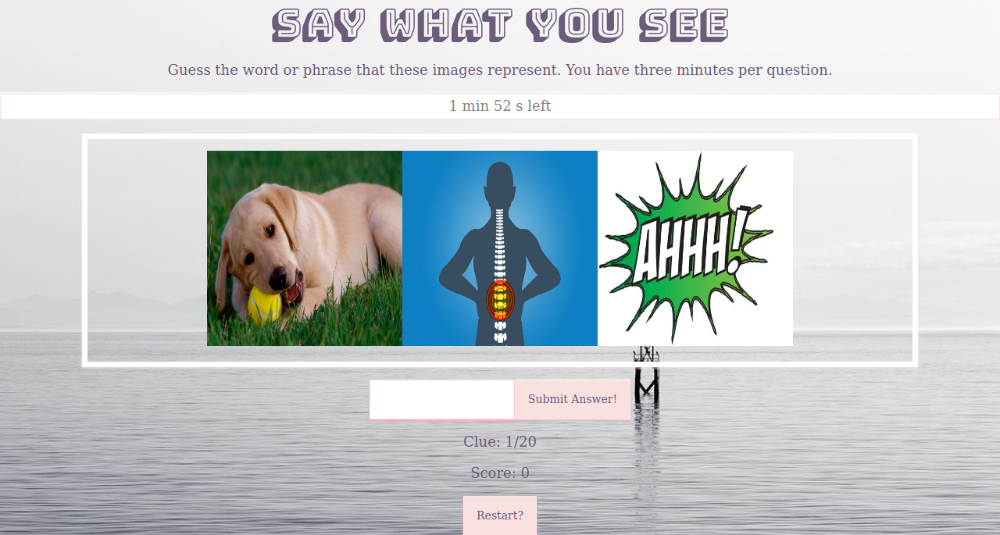
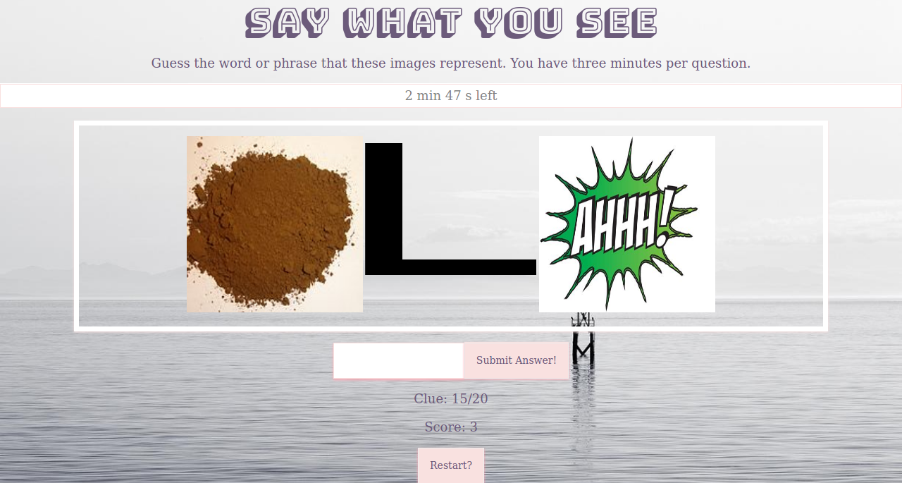
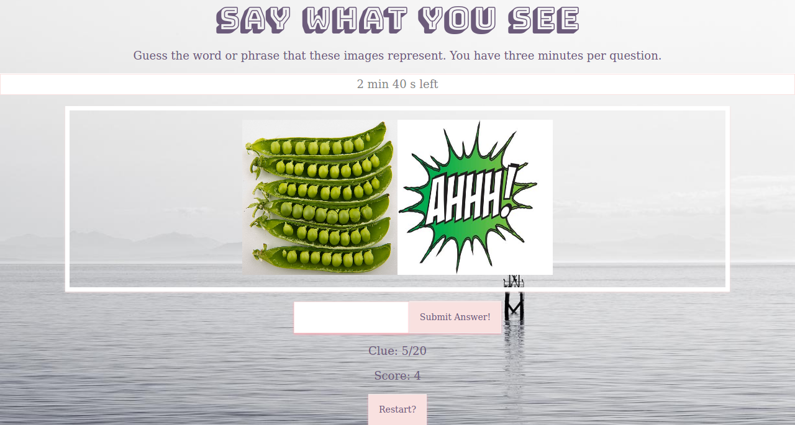

# Say What You See
This app is a a coding project to learn about different coding languages and web development.

## How It Works
A player has three minutes to guess the word or name represented by a sequence of images.  If they get the answer right in the time limit, they gain a point.

## The Link
Go check out the app [here](https://react-app-alicia639.herokuapp.com/).

## App Preview

The first clue.

A second example of a clue.

A clue with two images.

